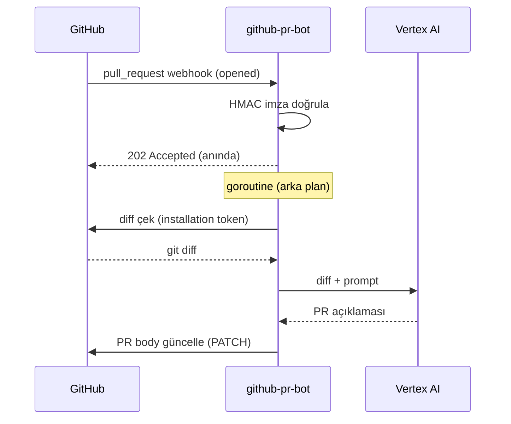

<div align="center">

# 🤖 github-pr-bot

**Yapay zeka destekli GitHub PR açıklama asistanı**

Kod değişikliklerini analiz eder, Vertex AI (Gemini) ile profesyonel Pull Request açıklamaları yazar — otomatik.


</div>

---

## ✨ Ne Yapar?

Bir Pull Request açıldığında bot devreye girer:

- 🔍 PR'ın **diff'ini** GitHub API'den çeker
- 🧠 Diff'i **Vertex AI (Gemini)**'ye gönderir, teknik ama sade bir açıklama üretir
- ✍️ Açıklamayı doğrudan **PR body'sine** yazar (idempotent — spam yok)
- ⚡ Her şey **arka planda** işlenir, webhook'a cevap anında döner

> Geliştiriciler kod yazar; PR açıklamasını bot yazar.

## 🔄 Nasıl Çalışır?



## 🏗️ Mimari

Katmanlı yapı — her sorumluluk ayrı:

```
cmd/server/main.go          🚀 Giriş noktası
internal/
├── config/                 ⚙️  Env yükleme (.env + os env)
├── controller/             🌐 HTTP handler — 202 döner, goroutine başlatır
├── middleware/             🔐 HMAC imza doğrulama + event filtre
├── model/                  📦 Webhook JSON struct'ları
├── router/                 🧭 Route + bağımlılık kurulumu (manuel DI)
└── service/
    ├── github.go           🐙 Diff çekme, PR body güncelleme (GitHub App auth)
    ├── llm.go              🤖 Vertex AI çağrısı + prompt engineering
    └── webhook.go          🔏 HMAC imza hesaplama
```

## 🧰 Teknoloji

| Katman | Araç |
|--------|------|
| Dil | Go 1.27 |
| Web framework | [Gin](https://github.com/gin-gonic/gin) |
| LLM | Vertex AI — Gemini (`google.golang.org/genai`) |
| GitHub auth | GitHub App — JWT + installation token ([ghinstallation](https://github.com/bradleyfalzon/ghinstallation)) |
| Config | [godotenv](https://github.com/joho/godotenv) |

## 🚀 Kurulum

### Gereksinimler

- **Go 1.27+**
- **GCP:** proje + Vertex AI API aktif + service account (`Vertex AI User` rolü)
- **GitHub App:** izinler → Pull requests `read/write`, Contents `read`; event → `Pull request`

### Adımlar

1. Bağımlılıkları indir:
   ```bash
   go mod download
   ```

2. `.env` oluştur (`.env.example`'ı kopyala, değerleri doldur).

3. Secret'ları `secrets/` altına koy:

   | Dosya | Kaynak |
   |-------|--------|
   | `secrets/app-private-key.pem` | GitHub App private key |
   | `secrets/vertex-key.json` | GCP service account key |

4. Çalıştır:
   ```bash
   go run ./cmd/server
   ```

5. Lokal test — webhook'u internete aç:
   ```bash
   ngrok http 8080
   ```
   GitHub App webhook URL → `https://<ngrok>/webhook`

## 🔑 Ortam Değişkenleri

| Değişken | Açıklama |
|----------|----------|
| `PORT` | Sunucu portu (varsayılan `8080`) |
| `GITHUB_WEBHOOK_SECRET` | Webhook imza secret'ı |
| `GITHUB_APP_ID` | GitHub App ID |
| `GITHUB_APP_PRIVATE_KEY_PATH` | App private key (`.pem`) yolu |
| `GCP_PROJECT_ID` | GCP proje ID |
| `GCP_LOCATION` | Vertex AI bölgesi (örn. `us-central1`) |
| `VERTEX_MODEL` | Gemini modeli (örn. `gemini-2.5-flash`) |
| `GOOGLE_APPLICATION_CREDENTIALS` | Service account JSON yolu |

## 📝 Tasarım Notları

- **Idempotent:** PR body güncellenir (yorum eklenmez) — kaç kez tetiklense tek açıklama.
- **Sonsuz döngü koruması:** sadece `opened` + `reopened` işlenir; body güncellemenin doğurduğu `edited` event'i atlanır.
- **Diff kırpma:** `maxDiffChars` (12000) üstü diff kırpılır — token limiti + maliyet.
- **Stateless:** veritabanı yok, her event anlık işlenir.
- **Güvenlik:** HMAC-SHA256 sabit zamanlı karşılaştırma (`hmac.Equal`) — timing attack'e kapalı.

## 📄 Lisans

MIT
